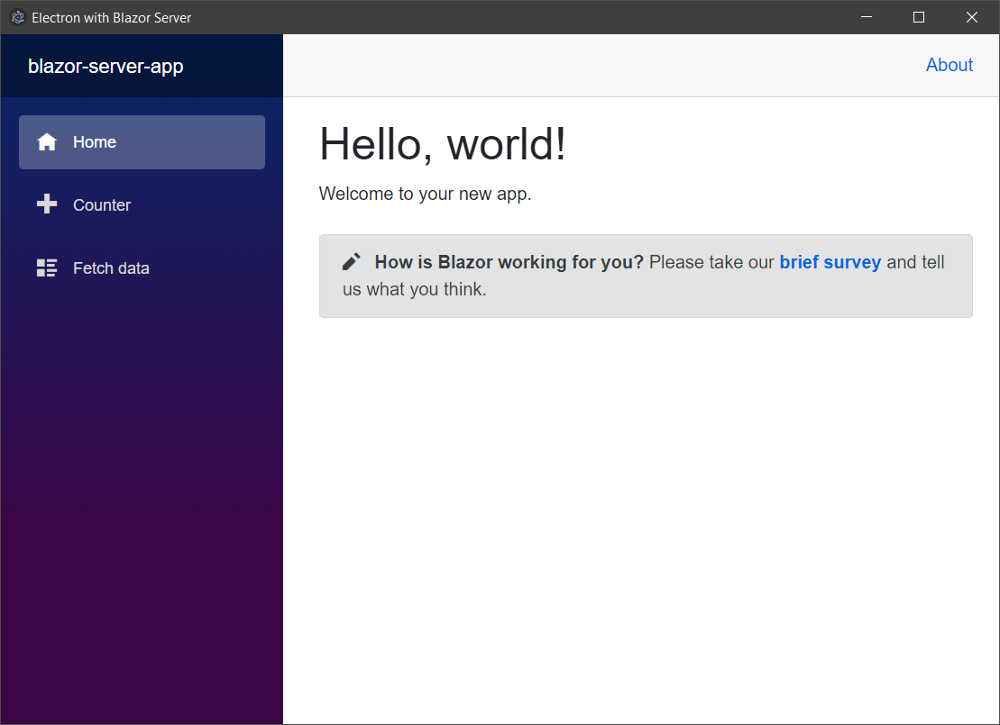
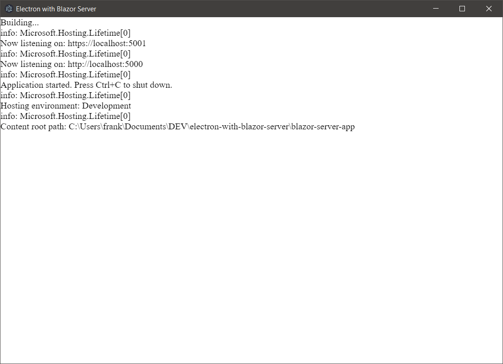

# electron-with-blazor-server

A simple project demonstrating how to spawn a Blazor Server app from Electron as
well as providing server logs directly in the Electron app.

Blazor Server App:

Press `Alt+CommandOrControl+L` to show the server log:

## Additional Information

The `blazor-server-app` folder is just a vanilla Blazor Server project.

## Dependencies

- Node [https://nodejs.org/]
- .NET 5 [https://dotnet.microsoft.com/]

## How to run

1. Clone the code repository.
2. Open terminal to code repository.
3. Run `npm install`. (See Dependencies above)
4. Run `npm run start` to start the application.

**NOTE**: The Blazor Server app uses a self signed certificate and Electron has
been configured to ignore certificate errors and turn off strict SSL. This
configuration is not suitable for production.

## Author(s)

Frank Hale &lt;frankhaledevelops@gmail.com&gt;

Updated on: 16 January 2021

## License

MIT - see [LICENSE](LICENSE)
